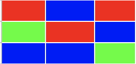
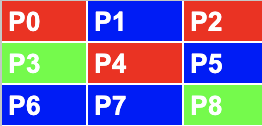
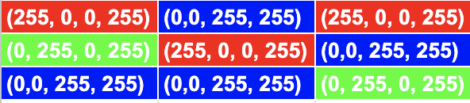

# Week 13: 4/15/26

## Agenda

1. Project #4 (Final) Critique
2. Other Areas of Interest
3. [Demos, Videos, Useful Links](#demos)

---

## Final Critique

You will be completing this activity in pairs and will have about 3 rounds of each.

5 minutes: **_without_** talking to the other person, write notes and feedback about their concept and sketch.

- Offer up options for alternative visual style
- Think about related projects and aesthetics
- Do you have any outstanding questions about how the library will be implemented?
- How would you improve this project?
- Include the answers to the questions of the project you are critiquing as well.

3 minutes: Exchange your papers and annotate their notes on _your_ project  
5 minutes (x2): talk with your partner to share notes, suggestions, questions, other feedback

## Other Areas of Interest

### Pixel Array

The [pixel array](https://p5js.org/reference/p5/pixels/) is an array that stores each pixel color of the canvas (or image).

Take a zoomed in pixel grid:



We are retrieving each pixel data:



And analyzing the RGBA values of each pixel:



Which will create a huge array storing all the pixel data.

| Pixel Index | Pixel on the Grid | RGBA? |
| --- | --- | --- |
| `pixels[0]` | P0 | R |
| `pixels[1]` | P0 | G |
| `pixels[2]` | P0 | B |
| `pixels[3]` | P0 | A |
| `pixels[4]` | P1 | R |
| `pixels[5]` | P1 | G |

We can retrieve all the pixels by using

```
(image).loadPixels()
```

### External Data

#### String Variable Types

Going back to class 2, we talked about different types of variables. But, strings (or words), have a lot of [special properties](https://developer.mozilla.org/en-US/docs/Web/JavaScript/Reference/Global_Objects/String) we can use to manipulate the text.

Take this [starter code](https://editor.p5js.org/samheckle/sketches/UDghY0Ha1r), and we will work with manipulating the `.txt` file with our javascript.

#### JSON

JSON (pronounced jay-son), is another type of file format used commonly to send data between clients and servers.


We can retrieve these files using an API (application programming interface), which is the way in which we can ask for and receive data.

The best way to do this in plain javascript is to use the [`fetch()` api](https://developer.mozilla.org/en-US/docs/Web/API/Fetch_API/Using_Fetch).

#### `fetch()`

In this example, we will be using the [OMDB api](https://www.omdbapi.com/), which we generated the token for at the beginning of class. We need to construct the request with javascript.

First, we need to say exactly what we are asking for in the request. We use JavaScript's native [URLSearchParams](https://developer.mozilla.org/en-US/docs/Web/API/URLSearchParams). This is in object format, which allows us to say what information we are giving, including our `token` that allows us to make the request.

```js
const params = new URLSearchParams({
	apikey: 'your-api-key-from-email',
	s: 'movie-you-are-searching-for',
	type: 'movie',
});

const url = 'http://www.omdbapi.com/?' + params;
```

Then we need to construct the URL.

```js
const url = 'http://www.omdbapi.com/?' + params;
```

Then we need to use `fetch()` with this and convert it to `.json`

```js
const response = await fetch(url);
const json = await response.json();
```

We must use the `await` keyword in order to ensure that the variable is populated before we move on.

#### More Interesting data and tools

- https://github.com/dariusk/corpora/
- https://tinytools.directory/

## Demos

- [pixel webcam](https://editor.p5js.org/samheckle/sketches/fQV1OjqRJ)
- [delay webcam](https://editor.p5js.org/samheckle/sketches/upGBdCuPF)

### Resources / Videos

- Coding Train [Data & API Playlist](https://www.youtube.com/watch?v=rJaXOFfwGVw&list=PLRqwX-V7Uu6a-SQiI4RtIwuOrLJGnel0r)
- Public API List: https://github.com/public-apis/public-apis
